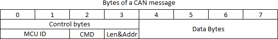
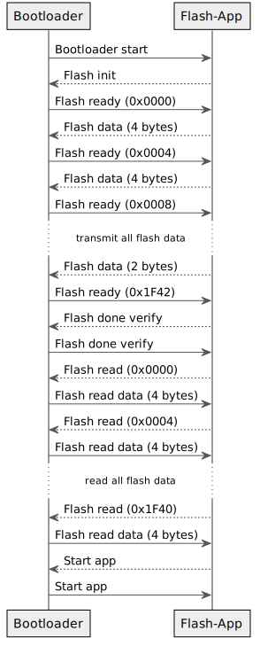

# MCP-CAN-Boot


CAN bus bootloader for **AVR microcontrollers** attached to an **MCP2515** CAN controller.

**Tests:** 

## Supported features

* Flash the main application into a MCU (microcontroller unit)
* Verify after flashing
* Read the whole flash (excluding the bootloader area)
* Erase the whole flash (excluding the bootloader area)
* Unique 16bit IDs to identify the MCU to flash
* Correctly handled disabling of the watchdog at startup to prevent bootloader loops when using the watchdog in the main application
* Use Extended Frame Format (EFF, default) or Standard Frame Format (SFF) CAN-IDs
* Very low impact on active CAN systems which enables to flash MCUs in active networks

## Currently supported AVR controllers

* [ATmega32](http://ww1.microchip.com/downloads/en/devicedoc/doc2503.pdf)
* [ATmega328P](http://ww1.microchip.com/downloads/en/DeviceDoc/Atmel-7810-Automotive-Microcontrollers-ATmega328P_Datasheet.pdf)
* [ATmega64](http://ww1.microchip.com/downloads/en/DeviceDoc/atmel-2490-8-bit-avr-microcontroller-atmega64-l_datasheet.pdf)
* [ATmega644P](https://ww1.microchip.com/downloads/en/DeviceDoc/Atmel-42744-ATmega644P_Datasheet.pdf)
* [ATmega128](http://ww1.microchip.com/downloads/en/DeviceDoc/doc2467.pdf)
* [ATmega1284P](https://ww1.microchip.com/downloads/en/DeviceDoc/doc8059.pdf)
* [ATmega2560](https://ww1.microchip.com/downloads/en/devicedoc/atmel-2549-8-bit-avr-microcontroller-atmega640-1280-1281-2560-2561_datasheet.pdf)

## Bootloader size

This bootloader will fit into a 2048 words (4096 bytes) bootloader section.

The fuse bits of the MCU have to be set correctly to a boot flash section size of 2048 words and the boot reset vector must be enabled (BOOTRST=0).

## Flashing the bootloader

To flash the _MCP-CAN-Boot_ bootloader you need to use an ISP programmer.

Make sure to set the fuse bits correctly for a 2048 words bootloader and boot resest vector enabled. Otherwise the bootloader will not work.

Examples for each supported controller are in `platformio.ini` (commented out by default).  
To set the fuse bits, enable the lines starting with `board_fuses.` for your controller. _Always check/edit the fuses values to fit your needs!_  
If you set the correct values, you may run `pio run --target fuses` to program the fuses on your controller.

## CAN bus communication

The whole communication via the CAN bus uses only two CAN-IDs.

*Defaults:*

* `0x1FFFFF01` for messages from MCU to remote
* `0x1FFFFF02` for messages from remote to MCU

Using this two IDs nearly at the end of CAN-ID range with the lowest priority there will be almost none interference flashing an MCU in a active CAN system.

Each CAN message consists of fixed eight data bytes.
The first four bytes are used for MCU identification, commands, data lengths and data identification. The other four bytes contain the data to read or write.

## Flash-App

The remote application for flashing the MCU using the CAN bus is written in [Node.js](https://nodejs.org/) and located in the [mcp-can-boot-flash-app repository](https://github.com/crycode-de/mcp-can-boot-flash-app).

The flash-app is also available on *npm* as `mcp-can-boot-flash-app`.

No need to install: Just run the flash-app using `npx` (this will take a moment):

```
npx mcp-can-boot-flash-app [...]
```

Or install it globally and run it if you need it more often:

```
npm install -g mcp-can-boot-flash-app
mcp-can-boot-flash-app [...]
```

### Flash-App parameters

```
--file, -f       Hex file to flash                         [string] [required]
--iface, -i      CAN interface to use               [string] [default: "can0"]
--partno, -p     Specific AVR device like in avrdude       [string] [required]
--mcuid, -m      ID of the MCU bootloader                  [string] [required]
-e               Erase whole flash before flashing new data          [boolean]
-V               Do not verify                                       [boolean]
-r               Read flash and save to given file (no flashing!), optional
                 with maximum address to read until                   [string]
-F               Force flashing, even if the bootloader version missmatched
                                                                     [boolean]
--reset, -R      CAN message to send on startup to reset the MCU
                 (<can_id>#{hex_data})                                [string]
--can-id-mcu     CAN-ID for messages from MCU to remote
                                                [string] [default: 0x1FFFFF01]
--can-id-remote  CAN-ID for messages from remote to MCU
                                                [string] [default: 0x1FFFFF02]
--sff            Use Standad Frame Format (SFF) instead of the default
                 Extended Frame Format (EFF) for the CAN-IDs         [boolean]
--help, -h       Show help                                           [boolean]
```

Example:

```
npx mcp-can-boot-flash-app -f firmware.hex -p m1284p -m 0x0042
```

## How to reset the MCU by your main application

You can use the watchdog to reset the MCU by your main application.

To do so, you have to disable all interrupts, setup the watchdog for a very short time and enter an infinite loop like this:
```c
#include <avr/wdt.h>   // include watchdog functions

cli();                 // disable interrupts
wdt_enable(WDTO_15MS); // watchdog timeout 15ms
while(1);              // wait for watchdog to reset mcu
```

This will reset your mcu and enter the bootloader.

In the flash-app you may use the -R or --reset argument to send a CAN message which triggers the code above to do reset.

## How to read the reset cause (MCUSR/MCUCSR) by your main application

_MCP-CAN-Boot_ clears the MCUSR/MCUCSR register on startup. This is needed for propper watchdog handling.  
The original MCUSR/MCUCSR value is stored in the R2 register by the bootloader which allows you to get it in your main application.

To get the original value of the MCUSR/MCUCSR register by you main application, you have to read from the R2 register.

### Read MCUSR/MCUCSR from R2 into a global variable

To add a globale variable `mcusr` containing the original value of the MCUSR/MCUCSR register just add the following
code on top of your main application:

```cpp
uint8_t mcusr __attribute__ ((section (".noinit")));
void getMCUSR(void) __attribute__((naked)) __attribute__((section(".init0")));
void getMCUSR(void) {
  __asm__ __volatile__ ( "mov %0, r2 \n" : "=r" (mcusr) : );
}
```

After this, the **global** variable `mcusr` is available and contains the value of the original MCUSR/MCUCSR register.  
You don't have to call `getMCUSR` manually! This done automatically by the `init0` section.

### Read MCUSR/MCUCSR from R2 into a local variable

To read the value into a local variable (e.g. inside your `main` function) just add the following code in your function:

```cpp
uint8_t mcusr;
__asm__ __volatile__ ( "mov %0, r2 \n" : "=r" (mcusr) : );
```

After this, the **local** variable `mcusr` is available and contains the value of the original MCUSR/MCUCSR register.

## Detailed description of the CAN messages

Each CAN message has a fixed length of 8 byte. Unneeded bytes will be set to `0x00` and simply ignored.



### Control bytes

The lower four bytes (0 to 3) are used as control bytes.

#### Control byte 0 and 1

These two bytes always contain the ID of the MCU (`MCU_ID` in `config.h`) to make sure the correct MCU will be flashed.
The ID is written in big-endian format, so byte 0 is the MSB and byte 1 the LSB.

#### Control byte 2

The command which is used to identify the type of message.
The commands are described below.

#### Control byte 3

Used to store the amount of the data bytes of the message and a part of the current flash address for verification.
Therefor the three bits 5 to 7 of this byte represent the data length (zero to four bytes) and the bits 0 to 4 are the lower five bits of the current flash address.
This byte will only be used in some commands and otherwise it will be set to `0x00`.


### Data bytes

The four data bytes 4 to 7 are set depending on the command.
If they contain flash data the byte 3 of the CAN message will be set accordingly.

### Commands

| Command                  | Binary       | Direction                       |
|--------------------------|--------------|---------------------------------|
| Bootloader start         | `0b00000010` | MCU to Remote                   |
| Flash init               | `0b00000110` | Remote to MCU                   |
| Flash ready              | `0b00000100` | MCU to Remote                   |
| Flash set address        | `0b00001010` | Remote to MCU                   |
| Flash address error      | `0b00001011` | MCU to Remote                   |
| Flash data               | `0b00001000` | Remote to MCU                   |
| Flash data error         | `0b00001101` | MCU to Remote                   |
| Flash done               | `0b00010000` | Remote to MCU                   |
| Flash done verify        | `0b01010000` | Remote to MCU and MCU to Remote |
| Flash erase              | `0b00100000` | Remote to MCU                   |
| Flash read               | `0b01000000` | Remote to MCU                   |
| Flash read data          | `0b01001000` | MCU to Remote                   |
| Flash read address error | `0b01001011` | MCU to Remote                   |
| Start app                | `0b10000000` | Remote to MCU and MCU to Remote |

*Hint:* All flash addresses will always be the uint32_t byte address with the bytes ordered in big-endian format.

#### Bootloader start

The *bootloader start* command will be send by the MCU when the bootloader is started up to notify a possibly waiting flash application.

The data bytes 4, 5 and 6 are set to the device signature 0, 1 and 2 of the AVR. This enables the remote flash application to identify the type of the MCU.

Data byte 7 is set to the command set version of the bootloader to make sure bootloader and flash application are speaking the same language.

After this message is send by the MCU the bootloader waits a limited amount of time (default 250ms, configurable via `TIMEOUT` in `config.h`) for the *flash init* command.
It no *flash init* is received the bootloader will start main application.

#### Flash init

*Flash init* have to be send by the flash application to the MCU after *bootloader start* and before the bootloader starts the main application.
This will enter the flashing mode of the bootloader and is the one and only command which must be timed correctly.

The data bytes 4, 5 and 6 must be set to the correct device signature like in *bootloader start*.

After the bootloader entered the flash mode the next flash address will be set to `0x0000` and a *flash ready* command will be send.

#### Flash ready

The *flash ready* command is send by the MCU when ever it is ready to receive the next flash data.

The four data bytes will be set to the flash address  where the next received flash data will be stored.
If this is not the address where the data should be stored, the flash application may send a *flash set address* command.

#### Flash set address

*Flash set address* may be used by the flash application to tell the bootloader where the next flash data should be stored.

If the address is set the MUC responds with a *flash ready* command.
If the requested address is out range of the flash area the MCU responds with a *flash address error* command.

#### Flash address error

The bootloader responds with *flash address error* if some command from the flash application requested a flash address which is out of range of the flash area of the MCU.

The triggering command will be discarded by the MCU.

The four data bytes will be set to the flash end address which is maximum supported flash address by this MCU (without the bootloader section).

It's up to the flash application to handle this error and let the bootloader know what to do next.

#### Flash data

*Flash data* is send from the flash application to the bootloader to transmit the content to flash.

It can contain one to four data bytes.
The number of data bytes must be set in bit 5 to 7 of the byte 3 (length and address part) of the CAN message.

To verify the correct flash address between flash application and bootloader the bits 0 to 4 of the byte 3 must be set to the LSB five bits of the flash address where the data belongs to.

If the data is accepted by the bootloader the flash address will be increased by the received data length and a *flash ready* command will be send. The flash application may directly send the next *flash data* after receiving the *flash ready* command.

If the address part from byte 3 mismatches the expected flash address by the bootloader a *flash data error* command will be send with the four data bytes set to the expected flash address.

The bootloader will respond with a *flash address error* if the data length will exceed the flash end address.

#### Flash data error

If the address part in byte 3 of a *flash data* command mismatches the expected flash address by the bootloader it will respond with a *flash data error*. The four data bytes will be set to the expected flash address.

It's up to the flash application to handle this error and let the bootloader know what to do next.

#### Flash done

A *flash done* can be send by the flash application if all flash data is transmitted.
The bootloader will write the remaining internal buffer to the flash and then start the main application.

#### Flash done verify

A *flash done verify* has to be send by the flash application if all flash data is transmit and the flash application wants to verify (read) the flash.
The bootloader will write the remaining internal buffer to the flash, send a *flash done verify* back to the flash application and wait for *flash read* commands.

#### Flash read

Using the *flash read* command the flash application may read the current flash data from the MCU.

In each *flash read* command the four data bytes must be set to the flash address to read from.
If the flash address is behind the flash end address (without bootloader area) a *flash read address error* will be send back to flash application.

There will always be four bytes read from the flash. In case of this exceeds the flash end address, the remaining bytes will be set to `0x00`.

The bootloader will respond with a *flash read data* message.

#### Flash read data

The bootloader sends a *flash read data* command in response to a *flash read*.

The data bytes will be set to flash data read from the MCU flash at the requested address.

In byte 3 of the CAN message there will be set the length of the read flash data (bit 5 to 7) and the LSB address part of the read flash address (bit 0 to 5).

Directly after receiving the *flash read data* the flash application may send the next *flash read* commend.

If all needed flash data is read by the flash application it have to send a *start app* command to let the bootloader exit the flashing mode and start the main application.

Additionally the flash application may continue to flash data using *flash set address* and *flash data* commands.

#### Flash read address error

A *flash address read error* will be send by the bootloader if a *flash read* tried to read data behind the flash end address (without bootloader section).

It's up to the flash application to handle this error and let the bootloader know what to do next.

#### Flash erase

The *flash erase* command my be send by the flash application to let the bootloader erase the whole flash (without the bootloader section).

When the erase is done the bootloader will set the next flash address to `0x0000` and respond with a *flash ready* command.

The flash application may use *flash erase* before the first *flash data* command to ensure a clean MCU flash before flashing a new application.

#### Start app

The *start app* command will be send by the bootloader to the flash application if the bootloader is starting the main application from flashing mode.

If the bootloader is starting the main application without entering flashing mode (normal MCU startup) no *start app* will be send.

Additionally a *start app* command may be send at any time by the flash application to the bootloader while the bootloader is in flashing mode. This will stop the flashing process without writing anything else to the flash and start the main application.

### Communication example



## Used frameworks and libraries

*MCP-CAN-Boot* is made as a [PlatformIO](https://platformio.org/) project.

It uses parts of the [Arduino](https://www.arduino.cc/) framework.

For controlling the MCP2515 a modified version of the [Arduino MCP2515 CAN interface library](https://github.com/autowp/arduino-mcp2515) is used.

## License

**CC BY-NC-SA 4.0**

[Creative Commons Attribution-NonCommercial-ShareAlike 4.0 International](https://creativecommons.org/licenses/by-nc-sa/4.0/)

Copyright (C) 2020-2021 Peter Müller <peter@crycode.de> [https://crycode.de](https://crycode.de)
